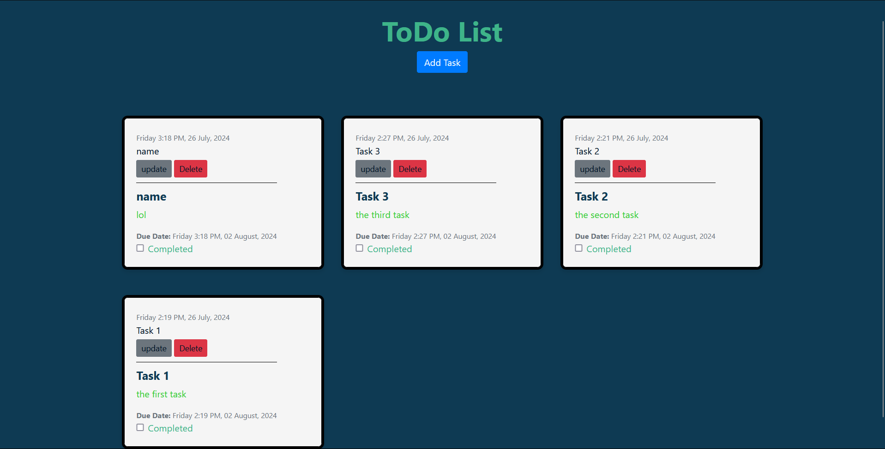
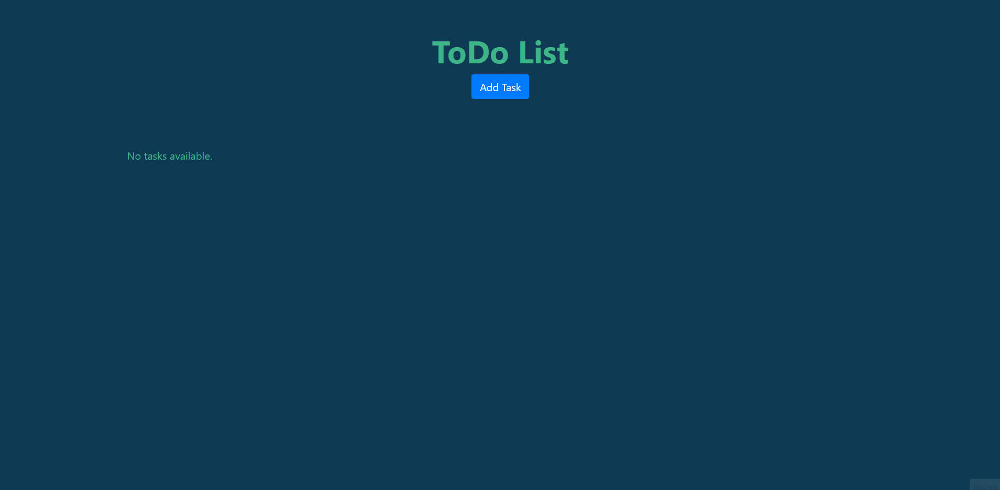

# ToDo Application
**Description**

This is a simple ToDo application built with Django and Bootstrap. It allows users to manage their tasks by adding, editing, and deleting them.


## screenshots
<div align="center">
  
  <h3><em><u>How the todo list works?</u></em></h3>
  
</div>
<br>

## Prerequisites

Make sure you have the following installed:

- A modern web browser (e.g., Chrome, Firefox, Safari)
- An internet connection (for fetching external dependencies)


## Installation

**1. Clone the repository:**

``` bash
git clone https://github.com/yourusername/todo-app.git
cd TodoApp
``` 

**2. Create a virtual environment and activate it:**

```bash
python3 -m venv venv
source venv/bin/activate  # On Windows use `venv\Scripts\activate`
```

**3. Install the dependencies:**

```bash
pip install -r requirements.txt
```

**4. Run the development server:**

```bash
python manage.py runserver
```
**5. Open the application in your browser**
```
http://127.0.0.1:8000
```

## Usage


### Adding a Task:

- click the add task button

### Editing a Task:

- Click the "update" button on a task.
- Modify the task details.
- Click the "submit" button to save changes.

### Completing a Task:

- Click the "Check" button on a task to toggle its completion status.

### Deleting a Task:

- Click the "delete" button on a task to delete it.


## Folder Structure
```bash
TODO_APP/
├── Data/
├── manage.py
├── requirements.txt
├── Task/
│   ├── __init__.py
│   ├── admin.py
│   ├── apps.py
│   ├── models.py
│   ├── tests.py
│   ├── urls.py
│   ├── views.py
│   ├── migrations/
│   ├── templates/
│   │   └── Task/
│   │       ├── base.html
│   │       ├── home.html
│   │       ├── task_form.html
│   │       ├── task_confirm_delete.html
|   |       └── task_detail.html
│   └── static/
│       └── Task/
│           └──start.css
└── TodoApp/
    ├── __init__.py
    ├── settings.py
    ├── urls.py
    ├── wsgi.py
    └── asgi.py
```


## License
This project is licensed under the MIT License. See the [LICENSE](LICENSE) file for details.
